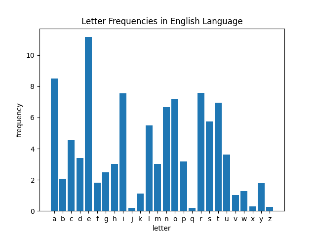

# Wordle Statistics

I had a discussion about the best wordle words. Obviously the best is to eliminate the most common letters (r, s, t, etc), as well as vowels. However it was pointed out that the most common letters might be different among 5-letter words. Thus... this small project to see the distributions of letters among 5-letter words.

I took valid words accepted by [wordle](https://www.powerlanguage.co.uk/wordle/) and plotted the occurances of each letter, was well as the most common letters within each position (1-5)

We see that common starter words such as ADEIU are actually quite bad. Not only are there more common consonants such as r, s, and t, but the position of the letters is not that common in eliminating answers. Instead, the best words are things like REAIS, SOARE, ROATE, or RAISE, which have 3 vowels and the common letters R, S, E. 

NOTE: This is not a wordle solver, there are plenty of those on the internet.

# Graphs

# Findings

In progress
