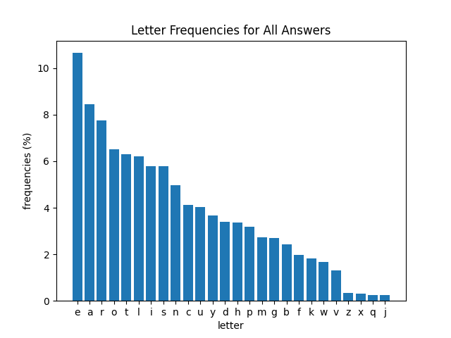
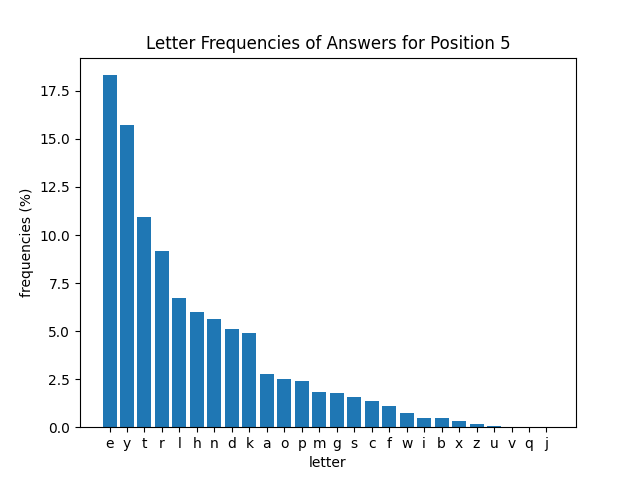

# Wordle Letter Distributions

NOTE: If you want the wordle answers, see [answers (spoilers)](data/searchableAnswers.txt)

NOTE: This is not a wordle solver, there are plenty of those on the internet. This is just some stats for me to check out

# About

Like everyone else, I was talking about [wordle](https://www.powerlanguage.co.uk/wordle/), and the best starting words. It was pointed out that the most common letters might be different among 5-letter words vs the entire english language. Thus... this small project to see the distributions of letters among 5-letter words.

I took valid words accepted by and plotted the occurances of each letter, was well as the most common letters within each position (1-5)

# Findings

We see that common starter words such as ADEIU are actually quite bad. Not only are there more common consonants such as r, s, and t, but the position of the letters is not that common in eliminating answers. Instead, the best words are things like REAIS, SOARE, ROATE, or RAISE, which have 3 vowels and the common letters R, S, E. 

* The most common 5-letter starting letter is s, and by a substantial amount. However it is the 8th most common in English
* Vowels are the most common 2nd letter, followed by r
* e as the 4th letter happens more than twice as frequently as any other letter
* The 5-letter distribution seems to be skewed less than the english distribution.
* s occurs over 30% as the last letter (can add s to a lot of 4-letter words to make plural). However, the actual answers are better distributed with e and y being the most common (see second to last graph)
* The answers follow more closely to the english distribution than the 5-letter distribution
* Pending...

# Graphs

