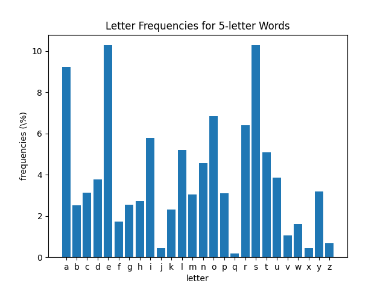
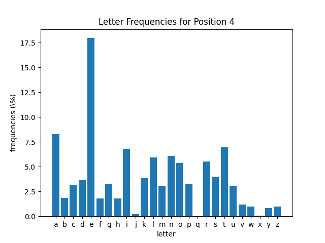

# Wordle Statistics

The most common letters in the english dictionary might be different than the most common letters in 5-letter words. I took valid words accepted by [wordle](https://www.powerlanguage.co.uk/wordle/) and plotted the occurances of each letter, was well as the most common letters within each position (1-5)

We see that common starter words such as ADEIU are actually quite bad. Not only are there more common consonants such as r, s, and t, but the position of the letters is not that common in eliminating answers. Instead, the best words are things like REAIS, SOARE, ROATE, or RAISE, which have 3 vowels and the common letters R, S, E. 
# Graphs

